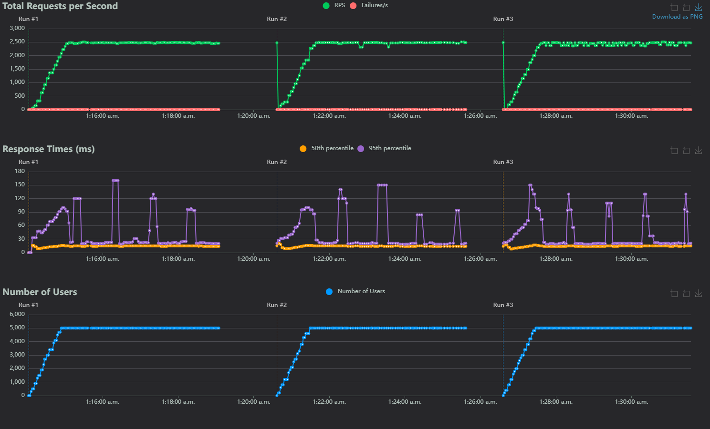

# Sockets

This test is just comparing a very naive and simple approach to a multithreaded HTTP server, with a hard coded result. This test doesn't provide a ton of value, besides helping me test how locust worked.

## Methodology

All tests were run using:

- [locust](https://locust.io/) (version 2.32.1) to generate load and graphs
  - Ran using `locust --processes -1` to use all available threads
  - Settings used
    - Direct IP connection (i.e. `http://192.168.1.1:<port>`)
    - Number of users 2, 500 and 5,000 (separate tests)
    - Users/sec 100
    - Time 5 mins
    - Tasks
      - A single GET request per user to `/`
- Load generated on a separate machine 
  - Connected via an ethernet 2.5Gbps connection
  - 16 cores, 32 threads
  - 32GB RAM

## Results

Some warnings before reading the results and methodology:

- This test did not last long enough for lengthy GC's to cause problems
- 5k and 2.5k concurrent users on something this simplistic is largely unreasonable
- 100 users/sec is also unreasonable, and gives little chance for servers to adapt to load
  - Closer to a DDOS than a typical usage pattern
- The task itself is incredibly simplistic, and is not reasonable (no DB calls, no template parsing, etc.)

### 5,000 users

\*Python is run 1, Java is run 2, go is run 3

Under Load :

| Language | Response times (ms) 50th Percentile | Response times (ms) 95th Percentile | Requests per second | Number of users | Link | Source | 
|----------|-------------------------------------|-------------------------------------|---------------------|-----------------|-------|--------|
| Go | 15 | 90 | ~2,472 | 5,000 | [Link](https://kieranwood.ca/performance-tests/sockets/results/go/2.5k) | [Link](https://github.com/Descent098/performance-tests/blob/main/sockets/go/sockets.go) |
| Python | 12 | 90 | ~2,470 | 5,000 | [Link](https://kieranwood.ca/performance-tests/sockets/results/python/2.5k) | [Link](https://github.com/Descent098/performance-tests/blob/main/sockets/python/main.py) |
| Java | 12 | 90 | ~2,475 | 5,000 |  [Link](https://kieranwood.ca/performance-tests/sockets/results/java/2.5k) | [Link](https://github.com/Descent098/performance-tests/blob/main/sockets/java/sockets.java) |

\*_Response times calculated as $\frac{rt_{max}+rt_{min}}{2}$ where $rt_{max}$ is the maximum response time under full 10k load, and $rt_{min}$ is the minimum check links in table for more granular details_

Takeaways:

- They're all essentially equivalent, and within margin of error

### 2,500 users

Under Load :

| Language | Response times (ms) 50th Percentile | Response times (ms) 95th Percentile | Requests per second | Number of users | Link | Source | 
|----------|-------------------------------------|-------------------------------------|---------------------|-----------------|-------|--------|
| Go | 11 | 79 | ~1,250| 2,500 | [Link](https://kieranwood.ca/performance-tests/sockets/results/go/5k) | [Link](https://github.com/Descent098/performance-tests/blob/main/sockets/go/sockets.go) |
| Python | 12 | 60 | ~1240 | 2,500 | [Link](https://kieranwood.ca/performance-tests/sockets/results/python/5k) | [Link](https://github.com/Descent098/performance-tests/blob/main/sockets/python/main.py) |
| Java | 12 | 35 | ~1243 | 2,500 |  [Link](https://kieranwood.ca/performance-tests/sockets/results/java/5k) | [Link](https://github.com/Descent098/performance-tests/blob/main/sockets/java/sockets.java) |

\*_Response times calculated as $\frac{rt_{max}+rt_{min}}{2}$ where $rt_{max}$ is the maximum response time under full 10k load, and $rt_{min}$ is the minimum check links in table for more granular details_

Takeaways:

- They're all essentially equivalent, and within margin of error
