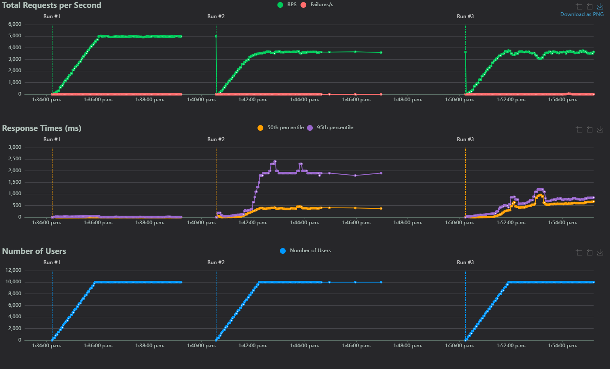

## HTTP basics

This test is just designed to compare a very basic HTTP server from each language. Specifically the stack for each language is:

- Go: The `net/http` standard library
  - https://pkg.go.dev/net/http
- Java: The `com.sun.net.httpserver` ["standard"](https://stackoverflow.com/questions/58764710/is-package-com-sun-net-httpserver-standard) library
  - https://docs.oracle.com/javase/8/docs/jre/api/net/httpserver/spec/com/sun/net/httpserver/package-summary.html
- Python: [FastAPI](https://fastapi.tiangolo.com/) + [uvicorn](https://www.uvicorn.org/)
  - The default http package in python does not support multithreading, making it unfair to use in this example

### Methodology

All tests were run using:

- [locust](https://locust.io/) (version 2.32.1) to generate load and graphs
  - Ran using `locust --processes -1` to use all available threads
  - Settings used
    - Direct IP connection (i.e. `http://192.168.1.1:<port>`)
    - Number of users 10,000
    - Users/sec 100
    - Time 5 mins
    - Tasks
      - A single GET request per user to `/`
- Load generated on a separate machine 
  - Connected via an ethernet 2.5Gbps connection
  - 16 cores, 32 threads
  - 32GB RAM

### Results

Some warnings before reading the results and methodology:

- This test did not last long enough for lengthy GC's to cause problems
- 10k concurrent users is largely unreasonable
- 100 users/sec is also unreasonable, and gives little chance for servers to adapt to load
  - Closer to a DDOS than a typical usage pattern
- The task itself is incredibly simplistic, and is not reasonable (no DB calls, no template parsing, etc.)

Under Load:

| Language | Response times (ms) 50th Percentile | Response times (ms) 95th Percentile | Requests per second | Number of users | Link | Source | 
|----------|-------------------------------------|-------------------------------------|---------------------|-----------------|-------|--------|
| Go | 6 | 20 | ~4980 | 10,000 | [Link](https://kieranwood.ca/performance-tests/http-basics/go) | [Link](https://github.com/Descent098/performance-tests/blob/main/http-basics/go/basic.go) |
| Python | 500 | 680 | ~3650 | 10,000 | [Link](https://kieranwood.ca/performance-tests/http-basics/python) | [Link](https://github.com/Descent098/performance-tests/blob/main/http-basics/python/basic.py) |
| Java | 465 | 2350 | ~3550 | 10,000 |  [Link](https://kieranwood.ca/performance-tests/http-basics/java) | [Link](https://github.com/Descent098/performance-tests/blob/main/http-basics/java/basic.java) |

\*_Response times calculated as $\frac{rt_{max}+rt_{min}}{2}$ where $rt_{max}$ is the maximum response time under full 10k load, and $rt_{min}$ is the minimum check links in table for more granular details_

Takeaways:

- Go is by far the most performant for this test
  - In particular the response time is 100x lower on the 50th percentile, which is quite significant
  - Generally Go was able to handle everything, there was 1 spike in response time around ~8k users, but isn't consistent across the tests
- Python ran much better than I thought
  - There is a bunch of optimizations I can run without making changes (like [pypy](https://pypy.org/), or [optimization mode](https://stackoverflow.com/questions/2055557/what-is-the-use-of-the-o-flag-for-running-python))
  - The response times steadily climbed with python, likely because of background running GC's, if it was left longer we would start to see the top end of that latency
  - Much easier to work with than java
- Java was dissapointing
  - It started showing first signs of struggling around 9k, but the 95th percentile results are rough compared to python
    - This means your users could be waiting up to 3 seconds before a response is sent, and this is a best case scenario because there isn't even any processing being done
    - It also makes debugging harder because of the difference between the 95th and 50th percentile
  - I personally find java a pain to work with, I typically "put up" with it, because I've been told it has better performance characteristics, I'm not so sure of that anymore
